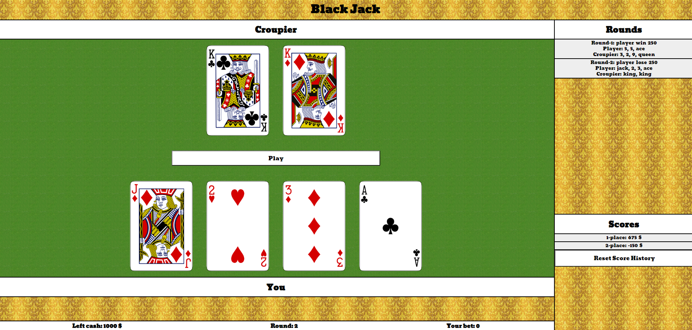

# Black Jack

This app is a standard BlackJack Game. Instruction on how to play can find here https://en.wikipedia.org/wiki/Blackjack. I created it using technologies such as like HTML5, CSS, SASS, JAVASCRIPT, ES6, REACT, and few libraries you can see on package.json file. Game use https://deckofcardsapi.com/ API to get all the cards.

# <h2>You can play this game by click below link: </h2>
https://hopeful-bassi-b2e712.netlify.app/

# <h1>Setup on your machine (requirements : installed Node.js) </h1>
1. Clone repository, 
2. On your terminal use commend: npm i, 
3. and then: npm start

### `npm start`

Runs the app in the development mode.\
Open [http://localhost:3000](http://localhost:3000) to view it in the browser.

The page will reload if you make edits.\
You will also see any lint errors in the console.

